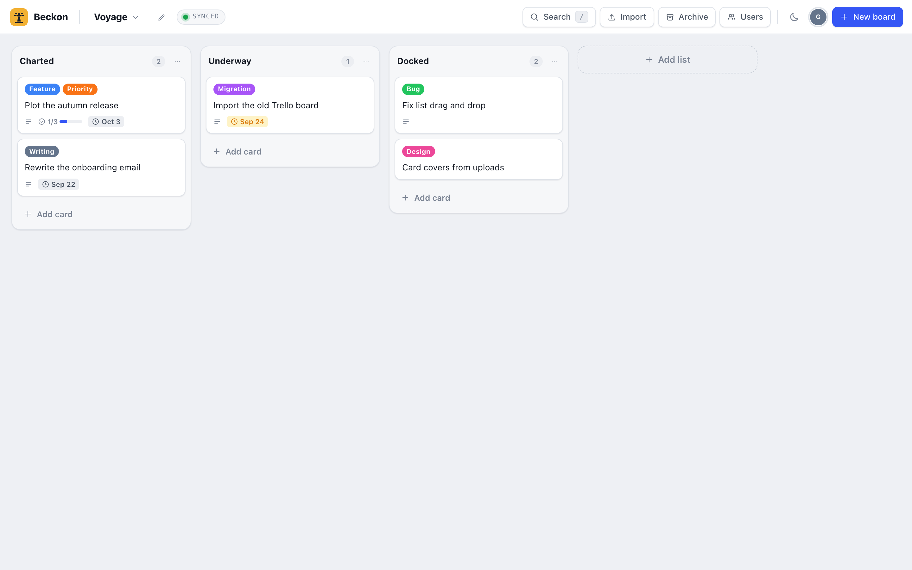
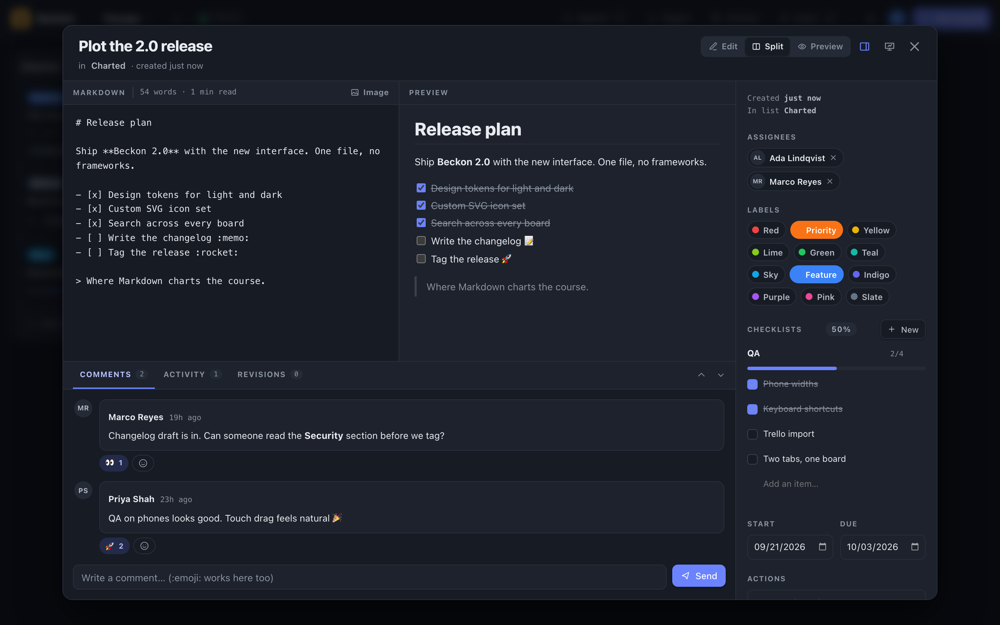

# Beckon

[](https://opensource.org/licenses/MIT)

**Beckon** is a self-hosted Kanban board that lives in a single PHP file. Boards are folders, cards are Markdown files, and there is no database, no build step, and no third-party JavaScript. Drop `index.php` on any server with PHP and you have a board.

*Where Markdown charts the course.*





## Why

Most Kanban tools own your data. Beckon keeps it in plain files you can open in a text editor, sync with Dropbox or Nextcloud, or commit to git. Everything the app needs ships in one file, so there is nothing to install, nothing to compile, and nothing that phones home. The interface is hand-built: custom CSS, custom SVG icons, and a small Markdown engine, all written for this app and all inline.

## Features

- **One file.** `index.php` is the whole app. Uploads and boards sit beside it.
- **Flat-file storage.** A board is a folder. Each card is a `.md` file for the description and a `.json` file for comments, checklists, dates and history.
- **Markdown editor with live preview.** Split, edit, or preview modes. Task lists (`- [ ]`) show up as progress on the board. Click in the preview to jump the cursor to that spot in the editor. Type `:` for emoji.
- **Drag and drop.** Reorder cards and lists. Drop or paste images straight into the editor. Set any upload as a card cover.
- **Labels, dates, assignees and checklists.** Due dates color by urgency on the board.
- **Revision history.** Every change to a description is kept. Scrub through old versions with a slider and restore any of them.
- **Comments with reactions.** Simple local identities, no accounts.
- **Search across boards.** Full-text search backed by SQLite FTS5, opened with `/` or Cmd+K.
- **Live reload.** Edit a card file on disk or from another tab and the board updates itself.
- **Trello import.** Lists, cards, labels, checklists, comments, members and attachments, including private boards.
- **Publish to WordPress.** Send a card to any WordPress site as a draft post. Images are uploaded first and the cover becomes the featured image.
- **Presentation mode.** Show a card full screen, or export it as a standalone HTML file.
- **Light and dark.** Follows your system by default. Toggle from the top bar.
- **Self-updating.** Verified downloads from GitHub releases, a one-click install with release notes, a restore link, and the same updater as a CLI command for cron or locked-down hosts. Idle installs never phone home.
- **Command line.** `beckon-cli.php` creates, lists, imports and exports cards for scripting. See [cli.md](cli.md).

## Install

Any server with PHP 8 works. For a quick local run:

```bash
mkdir beckon && cd beckon
curl -OL https://github.com/austinginder/beckon/releases/latest/download/index.php
PHP_CLI_SERVER_WORKERS=4 php -S localhost:8000
```

Open http://localhost:8000 and create your first board. Beckon writes to a `boards/` folder next to `index.php`, so that folder needs to be writable. The workers variable matters: PHP's built-in server answers one request at a time unless you give it more, and live reload keeps one request open. Without it Beckon still works, it just skips live reload.

Search needs the SQLite PDO extension, which ships with most PHP builds. Without it everything else still works and search is simply unavailable.

### With Cove

[Cove](https://cove.run) runs local PHP sites with real HTTPS. Add Beckon as a plain site:

```bash
cove add beckon --plain
cd $(cove path beckon)
git clone https://github.com/austinginder/beckon.git .
```

Then open https://beckon.localhost.

## How the data is stored

```
boards/
  search.db                 full-text index, rebuilt on demand
  my-project/
    layout.json             board title, lists, card order, archive
    users.json              board members
    2026-09-22_<id>.md      card description
    2026-09-22_<id>.json    comments, checklists, activity, revisions
    uploads/                images and attachments
```

Back up the `boards/` folder and you have everything. Move it to another install and the boards come with it.

## Keyboard shortcuts

| Key | Action |
|---|---|
| `/` or `Cmd+K` | Search across all boards |
| `Enter` | Open the card under the cursor |
| `c` | Archive the card under the cursor |
| `Esc` | Close whatever is open |
| Right click or long press | Card actions |

## Security

Beckon has no login. It assumes a trusted network or a server that handles authentication in front of it, such as HTTP basic auth or a VPN. Do not put it on the open internet as is.

## Beckon and Trello

The Trello importer brings over lists, cards, descriptions, labels, due dates, members, checklists, comments and attachments. For a private board, paste a "Copy as cURL" command from your browser and Beckon uses those cookies to download the attachments.

A few Trello things do not carry over: custom fields, stickers, votes, Butler automations and emoji reactions on comments (Trello leaves them out of its export). Beckon treats descriptions as GitHub-flavored Markdown, so Trello's own formatting quirks may render a little differently.

## Updating

Beckon checks GitHub for a new release at most once a week, and only while someone actually has a board open. An idle install never phones home. When a release is available the boards screen shows an update button with the release notes.

Installing downloads the release assets from GitHub, verifies them against the sha256 checksum GitHub publishes for the release, keeps the outgoing copies in `boards/.updates/`, and swaps the files in place. A "Restore" link on the boards screen puts the previous version back.

From a shell, the same updater is available as a command:

```bash
php beckon-cli.php update --check     # look only
php beckon-cli.php update             # install, with a prompt
php beckon-cli.php update --yes       # install unattended, for cron
php beckon-cli.php update --rollback  # restore the previous copy
```

Use the command when the web server cannot write to `index.php`. A git checkout is left alone by both paths; update it with `git pull`.

## License

MIT. See [license](license).
